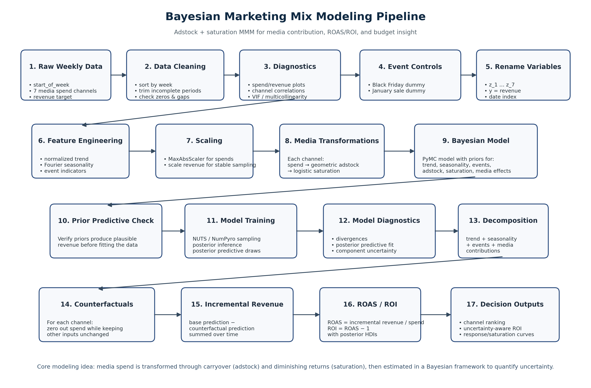

# Bayesian_MMM
End-to-end Bayesian MMM pipeline built for real-world media campaign analysis using probabilistic programming. The project models carryover effects, diminishing returns, and posterior ROI distributions to support data-driven marketing budget allocation.

* The following figure shows the pipeline I created for the project.

